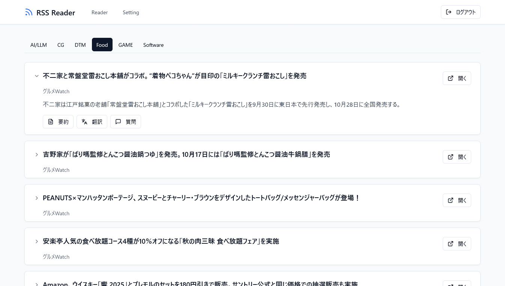

# fm-rss-reader-pb

[](LICENSE)

<p align="center">
  
</p>
**FM RSS Reader** は、個人利用に最適化された高機能なRSSリーダーアプリケーションです。バックエンドに [PocketBase](https://pocketbase.io/) を採用し、RSSフィードの収集・表示、AI(LLM)による記事の要約や翻訳、さらにはLLMエージェントから操作可能な [MCP (Model Context Protocol)](https://github.com/rerofumi/mcp) サーバー機能を統合しています。

---

## ✨ 主な機能

- **RSSフィード管理**:
    - **ジャンル**: ニュース、ブログ、技術情報など、フィードを自由に分類・管理できます。
    - **フィード登録**: ジャンルごとに複数のRSSフィードURLを簡単に登録・編集・削除できます。
- **高機能RSSリーダー**:
    - **タブUI**: ジャンルごとにタブが分かれており、読みたいカテゴリの記事へ素早くアクセスできます。
    - **時系列表示**: 記事は常に新しいものが一番上に表示され、最新情報を逃しません。
- **AIアシスタント連携**:
    - **記事の要約**: 長文の記事もワンクリックで要点を把握できます。
    - **記事の翻訳**: 外国語の記事も手軽に翻訳して読めます。
    - **自由な質疑応答**: 記事の内容について、対話形式でAIに質問できます。
- **MCPサーバー機能**:
    - **LLMエージェント連携**: 外部のLLMエージェントがアプリケーションを操作するためのAPIを提供します。
    - **セキュアなトークン管理**: フロントエンドから安全にMCPアクセストークンを発行・管理できます。
- **堅牢なユーザー認証**:
    - PocketBaseによる安全なアカウント管理。ログイン情報はセッションで維持されます。

## 🖥️ 画面構成

アプリケーションは、直感的に操作できる3つの主要ページで構成されています。

1.  **RSSリーダーページ**:
    - アプリケーションのメイン画面です。上部のタブでジャンルを切り替え、効率的に記事を閲覧できます。
2.  **管理ページ**:
    - RSSジャンルやフィードURLの登録・編集、MCPアクセストークンの発行など、すべての設定をこのページで一元管理します。
3.  **ログインページ**:
    - 安全なアクセスを保証するための認証ページです。未ログイン時は自動的にこちらにリダイレクトされます。

## 🛠️ 技術スタック

本プロジェクトは、モダンで信頼性の高い技術を組み合わせて構築されています。

- **バックエンド**:
    - **[PocketBase](https://pocketbase.io/)**: データベース、ユーザー認証、API、静的ファイル配信を単一の実行ファイルで実現。
- **フロントエンド**:
    - **Framework**: [Vite](https://vitejs.dev/) + [React](https://react.dev/)
    - **Language**: [TypeScript](https://www.typescriptlang.org/)
    - **State Management**: [Zustand](https://github.com/pmndrs/zustand)
    - **Styling**: [Tailwind CSS](https://tailwindcss.com/)
- **LLMプロバイダ**:
    - **[OpenRouter](https://openrouter.ai/)**: 複数の大規模言語モデルを透過的に利用。

## 🚀 実行方法

### 1. Dockerコンテナでの起動 (推奨)

最も簡単で推奨される起動方法です。

1.  `compose.yaml` ファイルを開き、`environment` セクションにある `OPENROUTER_API_KEY` にご自身の [OpenRouter](https://openrouter.ai/) APIキーを設定します。
    *(APIキーがなくてもAI連携機能以外は動作します)*

2.  以下のコマンドを実行して、コンテナをビルドし、バックグラウンドで起動します。
    ```bash
    docker compose build
    docker compose up -d
    ```

3.  ブラウザで `http://localhost:8090/` にアクセスします。

### 2. ローカル環境での開発実行

開発やカスタマイズを行う場合は、以下の手順でローカル環境をセットアップします。

1.  **PocketBaseのセットアップ**:
    - [PocketBaseの公式サイト](https://pocketbase.io/docs/) から実行バイナリをダウンロードし、パスの通ったディレクトリに配置します。

2.  **フロントエンドのビルド**:
    - `frontend` ディレクトリに移動し、必要なパッケージをインストールしてビルドします。
    ```bash
    cd frontend
    npm install
    npm run build
    ```
    - ビルドされた資材 (`frontend/dist` ディレクトリの中身) を `pb_public` ディレクトリにコピーします。

3.  **環境変数の設定**:
    - 環境変数 `OPENROUTER_API_KEY` にAPIキーを設定します。

4.  **サーバーの起動**:
    - プロジェクトのルートディレクトリで以下のコマンドを実行し、PocketBaseサーバーを起動します。
    ```bash
    pocketbase serve --dir pb_data --hooksDir pb_hooks --migrationsDir pb_migrations --publicDir pb_public
    ```
    *(パスは環境に応じて適宜調整してください)*

5.  ブラウザで `http://localhost:8090/` にアクセスします。

### ⚙️ 初回起動時の設定

1.  `pb_data` ディレクトリが存在しない状態で初めてPocketBaseを起動すると、コンソールに管理者アカウント作成用のURLが表示されます。
2.  表示されたURLにアクセスし、管理者用のE-mailとパスワードを登録してスーパーユーザーを作成します。
3.  作成した管理者アカウントで管理コンソール (`http://localhost:8090/_/`) にログインします。
4.  RSSリーダーを利用するための一般ユーザーアカウントを1つ作成してください。

## 🤖 MCPサーバーへのアクセス

1.  ブラウザでRSSリーダーにログインし、「管理 (Settings)」ページに移動します。
2.  「MCP Token」タブから、LLMエージェントがアクセスするためのトークンを発行します。
3.  エージェント側の設定で、HTTP接続先としてこのアプリケーションのURL (`http://localhost:8090`) を指定し、HTTPヘッダーに以下のようにAuthorization情報を追加します。

    ```
    Authorization: "Bearer <発行したMCPトークン>"
    ```

## 📄 ライセンス

このプロジェクトはMITライセンスの下で公開されています。詳細については[LICENSE](LICENSE)ファイルを参照してください。

## 👤 作者

- **rerofumi**
    - [GitHub](https://github.com/rerofumi)
    - rero2@yuumu.org
