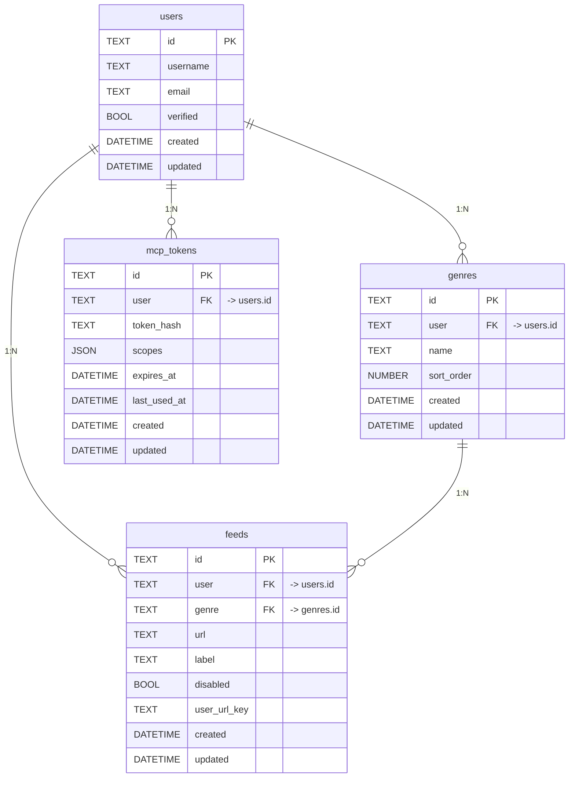

# DB スキーマ設計（PocketBase）

本ドキュメントは「01_claim.md」の要求を満たすためのデータモデルを定義する。記事データはキャッシュしない方針のため、ユーザーの分類（ジャンル）とフィード登録、MCP トークン発行に必要な最小のコレクションで構成する。

- 認証は PocketBase のシステムコレクション `users` を使用
- 記事本文は保存しない（都度 RSS を取得）
- マルチテナント隔離は各コレクションのアクセスルールで `@request.auth.id` と所有者リレーションを一致させて実現

## コレクション別の定義と意図

### users（PocketBase システムコレクション）
- 既定の `users` を利用（email/username 認証）。アプリ側で独自カラムは追加しない想定。

### genres（ジャンル）
- フィールド
  - user: relation(-> users) 必須。所有者。
  - name: text 必須。ジャンル名。
  - sort_order: number 任意。並び順（昇順小さいほど上）。
  - created/updated: 自動。
- 制約/インデックス
  - （推奨）ユーザー内で name の重複禁止。
    - 例: CREATE UNIQUE INDEX idx_genres_user_name ON genres(user, name);

### feeds（RSS フィード定義）
- フィールド
  - user: relation(-> users) 必須。所有者。
  - genre: relation(-> genres) 必須。分類先。
  - url: text 必須。RSS フィード URL（URL 形式バリデーション推奨）。
  - label: text 任意。表示名（サイト名等）。
  - disabled: bool 任意。無効化フラグ。
  - user_url_key: text UNIQUE 任意。`<userId>:<url>` のような複合一意キーの代替（アプリ側で設定）。
  - created/updated: 自動。

### mcp_tokens（MCP アクセストークン）
- フィールド
  - user: relation(-> users) 必須。所有者。
  - token_hash: text 必須。トークンのハッシュ値（プレーンは保存しない）。フィールドは hidden=true 推奨。
  - scopes: json 任意。スコープの配列等。
  - expires_at: datetime 任意。失効時刻。
  - last_used_at: datetime 任意。最終使用。
  - created/updated: 自動。
- 備考
  - トークンは生成時のみプレーンを返し、その後は照合をハッシュで実施。

## アクセスルール（PocketBase 例）
- すべて「認証必須」。他ユーザーのデータは不可。
- genres
  - listRule/viewRule: user = @request.auth.id
  - createRule: @request.auth.id != "" && user = @request.auth.id
  - updateRule/deleteRule: user = @request.auth.id
- feeds
  - listRule/viewRule: user = @request.auth.id
  - createRule: @request.auth.id != "" && user = @request.auth.id
  - updateRule/deleteRule: user = @request.auth.id
- mcp_tokens
  - listRule/viewRule: user = @request.auth.id
  - createRule: @request.auth.id != "" && user = @request.auth.id
  - updateRule/deleteRule: user = @request.auth.id
  - token_hash は hidden（クライアントへ返さない）

## 運用メモ
- RSS は都度取得（キャッシュしない）ため、feeds と genres のみで記事一覧表示に必要十分。
- フィード取得・LLM 呼び出しはバックエンド経由（CORS/鍵秘匿）。
- フロントエンド UI からのみ設定・管理・トークン取得を行うポリシーに合わせ、上記ルールでユーザーデータを厳密に分離する。
